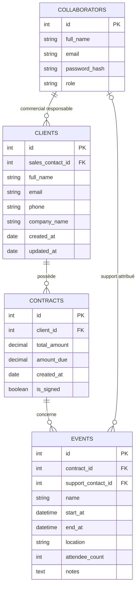

# Epic Events CRM

Projet de CRM en ligne de commande, développé étape par étape en Python.

## Étape 1 : environnement Python et base de données

SQLite est utilisé pour la première version. La base est un fichier local créé
automatiquement lors de la première connexion. SQLAlchemy fournit la connexion
qui servira aux modèles ORM des prochaines étapes.

Depuis le dossier du projet, avec Python 3.9 ou plus récent :

```powershell
python -m venv .venv
.\.venv\Scripts\python.exe -m pip install -r requirements.txt
Copy-Item .env.example .env
.\.venv\Scripts\python.exe database.py
```

Le dernier appel doit afficher `Connexion à la base de données réussie.` et
créer `epic_events.db`. Le fichier `.env` contient l'URL de connexion et n'est
pas versionné. Le fichier de base de données n'est pas versionné non plus.
Lancez les commandes depuis le dossier du projet, car le chemin SQLite dans
`.env` est relatif à ce dossier.

SQLite ne possède pas de comptes utilisateurs SQL ni de serveur à administrer.
Les droits d'accès au fichier sont ceux du compte Windows qui lance
l'application : utilisez un compte standard, sans droits administrateur, et
conservez la base dans un emplacement accessible uniquement à ce compte.
Les rôles et restrictions d'accès aux données du CRM seront implémentés dans
les étapes de développement.

## Étape 2 : modèles et tables

Après avoir configuré `.env`, créez les tables avec :

```powershell
.\.venv\Scripts\python.exe init_db.py
```

La commande peut être relancée : elle conserve les tables déjà présentes.



Le commercial d'un contrat est celui de son client. Les coordonnées du client
d'un événement sont accessibles par son contrat. Un événement peut attendre
l'attribution d'un support. Les règles propres aux rôles et la condition
« contrat signé avant création d'un événement » seront contrôlées dans
l'application lors des étapes de développement.

## Vérifications pendant le développement

Installez les outils de développement, puis lancez les contrôles :

```powershell
.\.venv\Scripts\python.exe -m pip install -r requirements-dev.txt
.\.venv\Scripts\python.exe -m black --check database.py models.py init_db.py tests
.\.venv\Scripts\python.exe -m pytest
```

Les tests utilisent une base SQLite temporaire en mémoire : ils ne modifient
pas `epic_events.db`. La commande `pytest` affiche aussi la couverture des
modules de connexion et de modèles. Ces contrôles seront à compléter au fur et
à mesure que l'application grandira.
